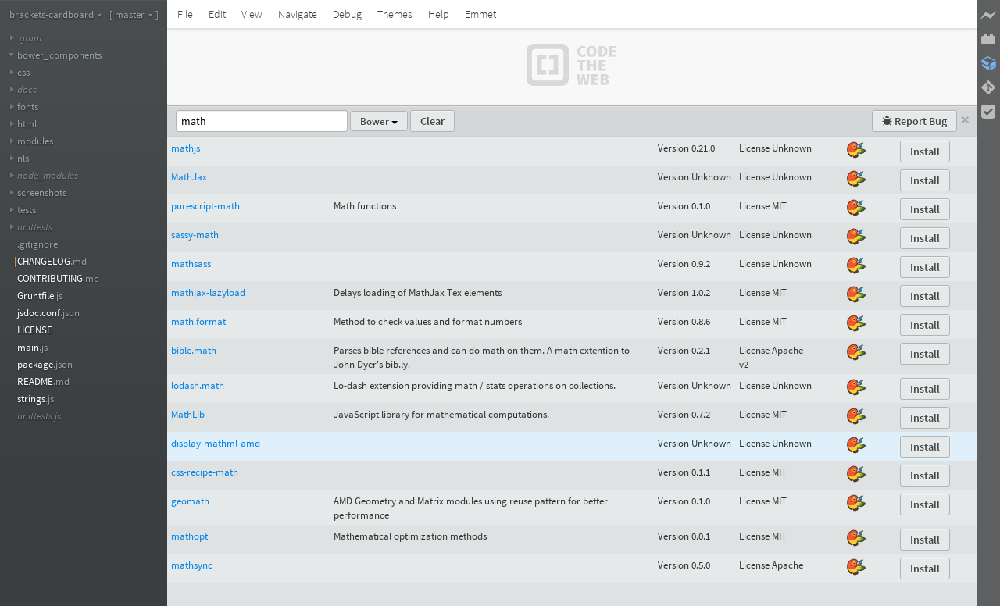
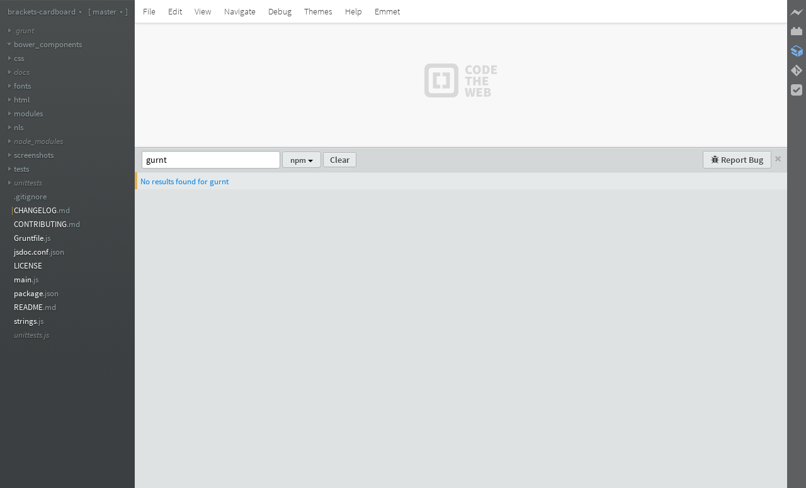
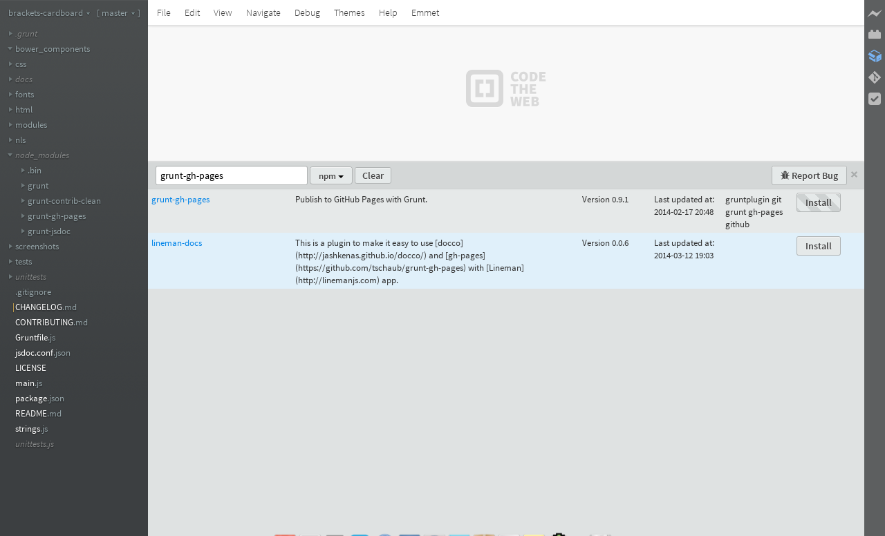
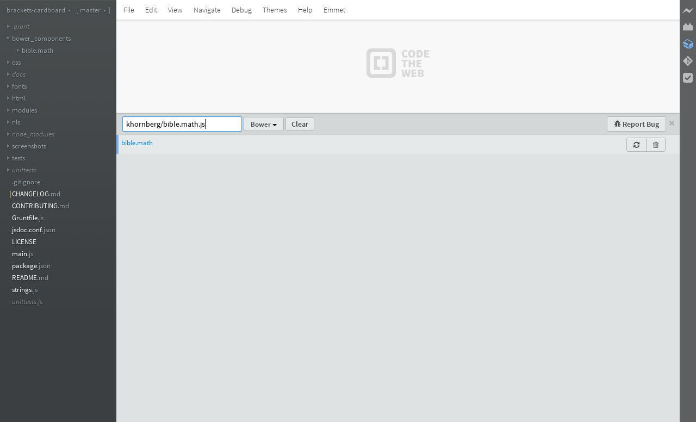
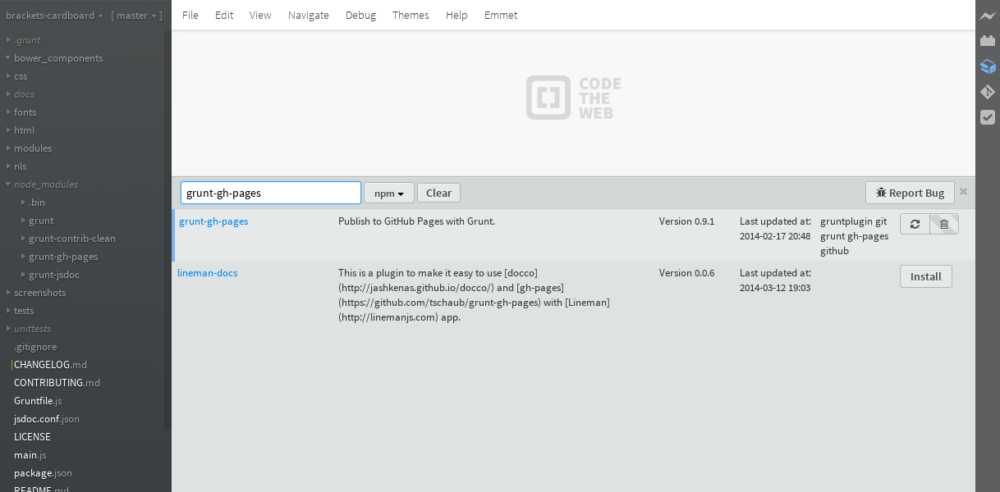

# Brackets Cardboard

Manage your project's packages or dependencies (depending on the tool) from within Brackets.

Cardboard?

What do most packages arrive in? A cardboard box. Your packages are arriving through this extension, thus it is called cardboard.

Initially this will have the ability to work with npm and bower (seemed like natural choices).

This is very early in development. Not everything works. Check the console for messages if you are curious.

## Screenshots

## TODO
* Interface (fix bugs to show/hide installed packages; the button is currently hidden)
* Tests (make them, put in unittests)
* Errors (handle them)
* NPM manager
* Preferences (set path variables, exclude managers, etc)
* Load new managers dynamically

## Contributing

Yes, please. See the TODO list and [CONTRIBUTING](CONTRIBUTING.md). Report an issue, make a request. All are welcomed.

## Documentation

[Rudimentary docs are available.](http://khornberg.github.io/brackets-cardboard)

## Load a new manager

Currently, the way to load a new manager is to edit the `modules/Interface.js` file.
To have Cardboard include a manager by default, send a PR.

** I want to get to this. Dynamic loading currently doesn't work.**

>Open the `managers` folder in this extension folder and add the file. The easiest way to get to the folder is to select `Help->Show Extensions Folderr`.

>brackets-cardboard loads all the managers in the `modules/managers` extension folder.

## License
[Apache 2.0](LICENSE)

## On Creation
I used brackets...
Also used code from the Brackets-Extension-toolkit, brackets-git, brackets-todo, and Raymond Camden's article on CodeTuts+

